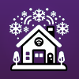

<div style="text-align: center;">



# homebridge-snowsense

An Occupancy Sensor that indicates snowy conditions using local weather forecast

[](https://github.com/homebridge/homebridge/wiki/Verified-Plugins)
[](https://github.com/bbernstein/homebridge-snowsense)
[](https://github.com/bbernstein/homebridge-snowsense)
[](https://www.npmjs.com/package/homebridge-snowsense)
</div>

This is a plugin for [homebridge](https://github.com/nfarina/homebridge) that is a simple Occupancy Sensor that automatically detects occupancy ON when it's going to snow soon and OFF a while after it stops snowing. Think of **snow** being the **occupant** and you have ample warning of when the (un)welcome guest arrives.

This is based on my earlier project, [homebridge-snowswitch](https://github.com/bbernstein/homebridge-snowswitch) that was similar but acted as a switch rather than a sensor. That former project is no longer supported and does not work.


## New in v2.x

The app was mostly rewritten in TypeScript with settings now compatible with [homebridge-config-ui-x](https://www.npmjs.com/package/homebridge-config-ui-x) so it can be installed and configured without manually editing a config file.


## Installation

For any installation, you'll first need to get an *API Key* from [OpenWeather API](https://openweathermap.org/api/).

### Homebridge UI

Go to 'Plugins' page, search for `homebridge-snowsense` and click 'install'.

### Manually

1. Install homebridge using: `npm install -g homebridge`
2. Install this plugin using: `npm install -g homebridge-snowsense`
3. Update your configuration file. Read below.

## Configuration

### Homebridge UI

Click the 'Settings' button for the plugin and enter the required information.

### Manually

Add the following information to your config file.

**apiKey** [no default] is the *Secret Key* as assigned from 
[OpenWeather](https://openweathermap.org/api)

**apiVersion** [default=3.0] is the version of the API to use. If you ware new to 
this, then you'll want to use 3.0.

**apiThrottleMinutes** [default=15] is the number of minutes to wait between 
API calls. This is to prevent exceeding the API call limit.

**debugOn** [default=false] is a flag to enable debug logging.

**location** field [no default] identifies the location for the snow checking. 
It can be a "city,state,country" (eg "Boston,MA,US"), or zip code (eg 02134), 
or "latitude,longitude" pair.

**units** [default='imperial'] (values 'metric' or 'imperial') is the units 
defined in [OpenWeather Docs](https://openweathermap.org/api/one-call-api). 
Basically, 'imperial' is Fahrenheit and 'metric' is Celcius. 

**sensors** field [no default] is an array of sensors to create. Each sensor
has the following fields:

**displayName** field [no default] is the name you will see in the *Home* app for
this sensor.

**hoursBeforeSnowIsSnowy** field [default=3] is number of **hours** before 
snow starts that the occupancy should go **on**. In other words, if the forecast
says it's going to snow in 3 hours or less, then the sensor turns on.

**hoursAfterSnowIsSnowy** field [default=3] is number of **hours** after 
snow is last seen that the occupancy should go **off**. In other words, if the
the last time the current weather said it was snowing 3 or more hours ago, then
the sensor turns off.

**consecutiveHoursFutureIsSnowy** field [default=0] is number of consecutive
**hours** of snow after it starts should trigger the sensor. In other words, if
this is set to two and the forecast says it starts snowing in one hour and it will 
also be snowing in two hours, then the sensor turns on.

Here's what the config might look like inside the `platforms` section.

```
        {
            "platform": "SnowSense",
            "name": "SnowSense",
            "apiKey": "**** get your key from OpenWeather ****",
            "apiVersion": "3.0",
            "debugOn": true,
            "apiThrottleMinutes": 15,
            "units": "imperial",
            "location": "Newton,ma,us",
            "onlyWhenCold": false,
            "coldTemperatureThreshold": 32,
            "sensors": [
                {
                    "displayName": "Snowing Now",
                    "hoursBeforeSnowIsSnowy": 0,
                    "hoursAfterSnowIsSnowy": 0,
                    "consecutiveHoursFutureIsSnowy": 0
                },
                {
                    "displayName": "Is Snowy",
                    "hoursBeforeSnowIsSnowy": 3,
                    "hoursAfterSnowIsSnowy": 3,
                    "consecutiveHoursFutureIsSnowy": 0
                }
            ]
        }

```

## Why this exists

I created this for a specific use case, which is to turn on and off snow melting 
mats outside my house.

I have been happy with [HeatTrak](https://heattrak.com/) Snow Melting Mats 
and when I purchased wireless outlets for them, I liked them even more. 
So, on one snowy weekend I decided to take the automation to the next level 
and build this plug-in.

Now, if the local forecast expects snow in the next few hours, the snow 
melting mats will turn on, and when the snow stops falling, the mats will 
turn off a few hours later.

I bought a set of [Etekcity](https://www.amazon.com/gp/product/B074GVPYPY) outlets
and installed [homebridge](https://github.com/nfarina/homebridge) and 
[homebridge-vesync](https://www.npmjs.com/package/homebridge-vesync) to control 
them from the my Apple-centric home using HomeKit.

To make them work with [HomeKit](https://www.apple.com/ios/home/), I needed 
to get [homebridge](https://www.npmjs.com/package/homebridge) working. I 
had an old [Raspberry Pi](https://www.raspberrypi.org/) sitting around so 
I [installed it there](https://github.com/nfarina/homebridge/wiki/Running-HomeBridge-on-a-Raspberry-Pi) 
and put the device in a closet with the rest of my network gear. 

This should work pretty well with any switches you can get working with 
[HomeKit](https://www.apple.com/ios/home/), and if you can also get 
a [homebridge](https://www.npmjs.com/package/homebridge) setup working 
and a [OpenWeather](https://openweathermap.org/api) API key, then the HomeKit 
App end of this is pretty trivial. 

## How to set up the automation

- Launch the [iPhone or iPad **Home** app](https://support.apple.com/en-us/HT204893)
- Create scenes; one to turn **on** the Snow Mats and another to turn them **off**
- Create a new **Automation**
- Select **An accessory is Controlled** as the trigger for the automation
- Select the Controller **IsSnowy**
- Select *When* to be **Turns On**
- Select the **Snow Mats On** scene
- Repeat for turning **Off** when the controller **Turns Off**

## Development notes

The latest version of this plugin was build following information from 
[Homebridge Plugin Development](https://developers.homebridge.io/#/) 
and the example 
[Homebridge Platform Plugin Template](https://github.com/homebridge/homebridge-plugin-template)
and several other plugins around github.

### Reminders to the developer
(since I usually only look once a year and forget these things)

How to release a new [beta version](https://github.com/homebridge/homebridge-plugin-template#publishing-beta-versions):

How to increment beta version:

```agsl
npm run prepublishOnly
npm version prerelease
npm publish --tag beta
```

How to [release a new version](https://github.com/homebridge/homebridge-plugin-template#versioning-your-plugin).

eg (when updating patch version):

```agsl
npm run prepublishOnly
npm version patch
npm publish
```

I've added a github action [ai-code-review-action](https://github.com/marketplace/actions/ai-code-review-action)
to do code reviews on all pull requests. I'm using a fork of the original that allows setting
the specific OpenAI model to use.
It requires an openai api key to work. You can get one for free at https://platform.openai.com/.
If you fork this repo and want to use it, you'll need to add the key to your repo secrets
as `OPENAI_API_KEY` and `GH_TOKEN` (for the action to be able to post comments).

## Reporting Issues and Suggestions

Please use the [GitHub Issue Tracker](https://github.com/bbernstein/homebridge-snowsense/issues)
to submit reports of issues or suggestions for improvements.

## Thanks

* Thanks to @apollo316 on github for pointing out that the DarkSky api is going 
away and @nicoryan and others for recommending OpenWeather.
* Thanks to @rmkjr for suggesting moving from a Switch to an Occupancy Sensor.
* Thanks to @scoutbeer for detailed feedback and help testing v2.0.
* Thanks to @nvogt for suggesting temperature and consecutive hour options.
* Thanks to you for checking it out.
